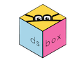

<!-- README.md is generated from README.Rmd. Please edit that file -->

# dsbox 

<!-- badges: start -->

[](https://github.com/rstudio-education/dsbox/actions)
<!-- badges: end -->

The goal of dsbox is to supplement the Data Science Course in a Box
project. The package contains the datasets that are used in the
materials in Data Science Course in a Box as well as the learnr
tutorials.

## Installation

<!--

You can install the released version of dsbox from [CRAN](https://CRAN.R-project.org) with:

``` r
install.packages("dsbox")
```
And the development version from [GitHub](https://github.com/) with:

-->

dsbox is not yet on CRAN. For now, you can install it from GitHub with

``` r
# install.packages("devtools")
devtools::install_github("rstudio-education/dsbox")
```

## Questions, bugs, feature requests

You can file an issue to get help, report a bug, or make a feature
request.

When filing an issue to get help or report a bug, please make a minimal
**repr**oducible **ex**ample using the
[reprex](https://reprex.tidyverse.org/) package. If you haven’t heard of
or used reprex before, you’re in for a treat\! Seriously, reprex will
make all of your R-question-asking endeavors easier (which is a pretty
insane ROI for the five to ten minutes it’ll take you to learn what it’s
all about). For additional reprex pointers, check out the [Get
help\!](https://www.tidyverse.org/help/) section of the tidyverse site.

Before opening a new issue, be sure to [search issues and pull
requests](https://github.com/rstudio-education/dsbox/issues) to make
sure the bug hasn’t been reported and/or already fixed in the
development version. By default, the search will be pre-populated with
`is:issue is:open`. You can [edit the
qualifiers](https://help.github.com/articles/searching-issues-and-pull-requests/)
(e.g. `is:pr`, `is:closed`) as needed. For example, you’d simply remove
`is:open` to search *all* issues in the repo, open or closed.

## Code of Conduct

Please note that the dsbox project is released with a [Contributor Code
of
Conduct](https://contributor-covenant.org/version/2/0/CODE_OF_CONDUCT.html).
By contributing to this project, you agree to abide by its terms.
