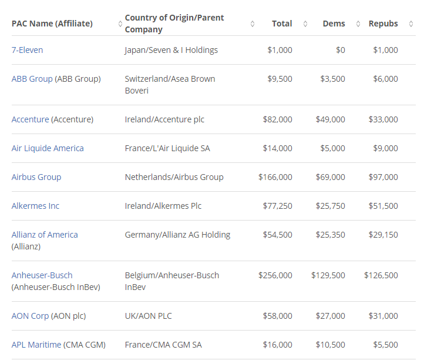
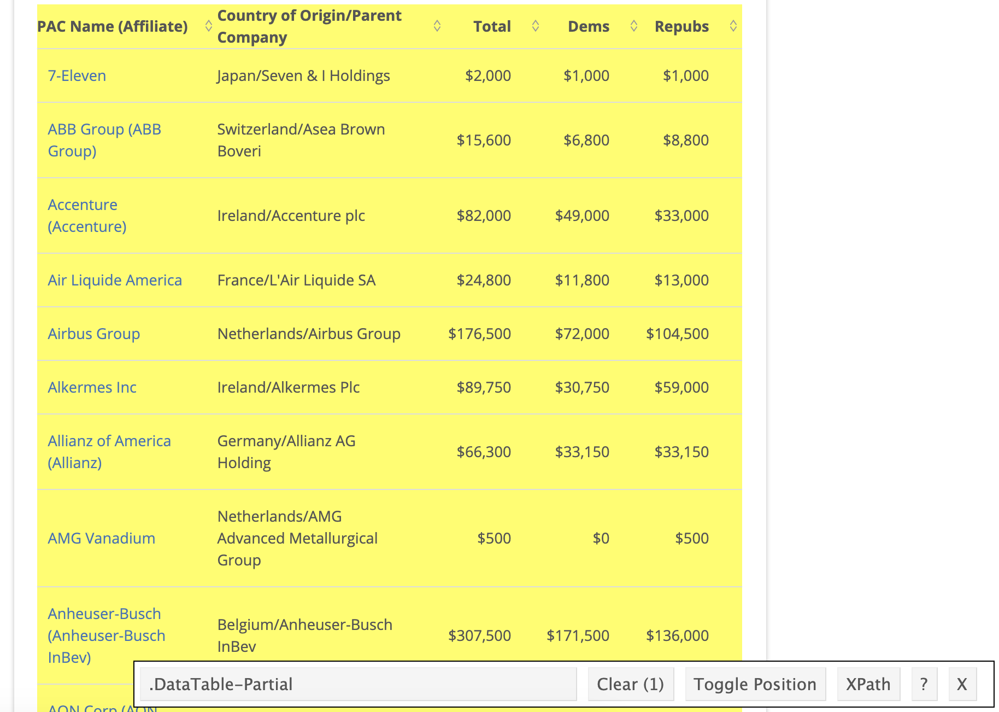
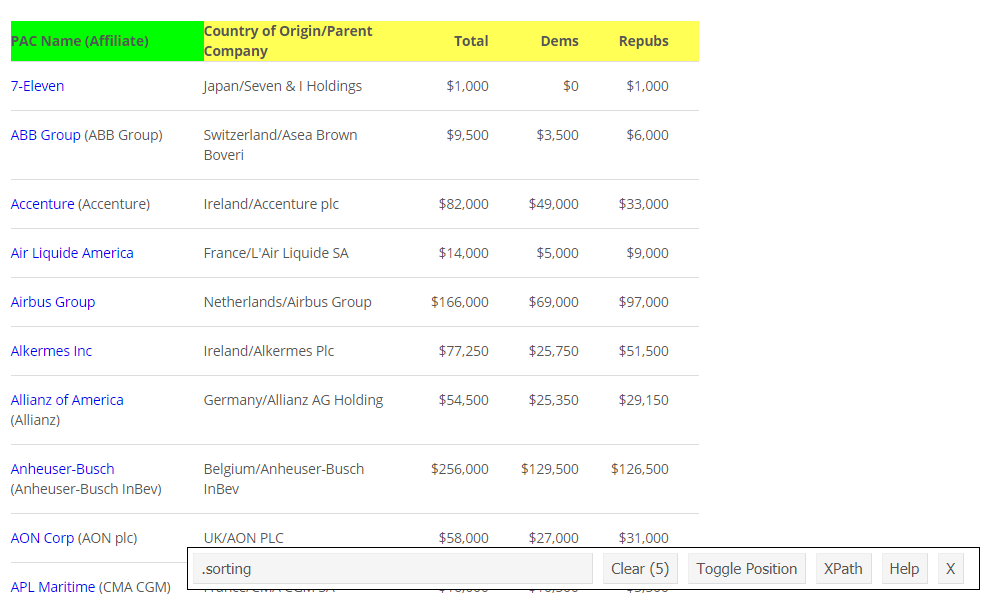

<!-- Add JavaScript code for making the exercise code larger -->
<script language="JavaScript" src="js/exercise-font-size.js"></script>

```{r setup, include=FALSE}
# load packages ----------------------------------------------------------------

library(learnr)
library(gradethis)
library(tidyverse)
library(robotstxt)
library(rvest)
library(scales)
library(dsbox)
library(DT) 

# set options for exercises and checking ---------------------------------------

gradethis_setup()


# hide non-exercise code chunks ------------------------------------------------

knitr::opts_chunk$set(echo = FALSE)


# setup some things ------------------------------------------------------------
url_2020 <- "https://www.opensecrets.org/political-action-committees-pacs/foreign-connected-pacs/2020"
page <- read_html(url_2020)

parse_currency <- function(x){
  x %>% 
    str_remove("\\$") %>%
    str_remove_all(",") %>%
    as.numeric()
}
```


```{r glimpse-pac-2020-setup}
# Before renaming
pac_2020 <- dsbox::pac_2020_raw
```

```{r rename-pac-2020-setup}
# Before renaming
pac_2020 <- dsbox::pac_2020_raw
```

```{r glimpse-pac-2020-2-setup}
# After renaming
pac_2020 <- dsbox::pac_2020_raw %>%
  rename(
    name = `PAC Name (Affiliate)` ,
    country_parent = `Country of Origin/Parent Company`,
    total = Total,
    dems = Dems,
    repubs = Repubs
  )
```

```{r glimpse-pac-2020-3-setup}
# After renaming and squishing
pac_2020 <- dsbox::pac_2020_raw %>%
  rename(
    name = `PAC Name (Affiliate)` ,
    country_parent = `Country of Origin/Parent Company`,
    total = Total,
    dems = Dems,
    repubs = Repubs
  ) %>%
  mutate(name = str_squish(name))
```

```{r clean-pac-all}
pac_all_final <- dsbox::pac_all %>%
  filter(
    country == "UK",
    year < 2020
    ) %>%
  group_by(year) %>%
  summarise(
    Democrat = sum(dems),
    Republican = sum(repubs),
    .groups = "drop"
  ) %>%
  pivot_longer(
    cols = c(Democrat, Republican), 
    names_to = "party", 
    values_to = "amount"
    )
```

## Introduction

```{r money-pic, fig.margin = TRUE, echo = FALSE, out.width = "100%", fig.cap="Photo by Sharon McCutcheon on Unsplash"}

```

Every election cycle brings its own brand of excitement – and lots of money. 
Political donations are of particular interest to political scientists and other researchers studying politics and voting patterns. 
They are also of interest to citizens who want to stay informed of how much money their candidates raise and where that money comes from.

In the United States, *“only American citizens (and immigrants with green cards) can contribute to federal politics, but the American divisions of foreign companies can form political action committees (PACs) and collect contributions from their American employees.”* [[Source](https://www.opensecrets.org/political-action-committees-pacs/foreign-connected-pacs)]

In this assignment we will scrape and work with data foreign connected PACs that donate to political campaigns in the United States. 
We will begin by scraping the data for foreign connected PAC contributions in the 2020 election cycle.

In order to complete this assignment you will need a Chrome browser with the [Selector Gadget extension](http://selectorgadget.com/) installed.

### Learning goals

- Get started with scraping data from the web. 
- Continue to build on your data cleaning and visualisation skills. 

### Packages

In this assignment we will work with the following packages: `tidyverse` and `scales` (which you should be familiar with), and `robotstxt` and `rvest` for web scraping. We also use the `dsbox` package for pre-scraped data.
You can load them with the following:

```{r load-packages, exercise=TRUE}
library(tidyverse)
library(robotstxt)
library(rvest)
library(scales)
library(dsbox)
```

```{r load-packages-solution}
library(tidyverse)
library(robotstxt)
library(rvest)
library(scales)
library(dsbox)
```

```{r load-packages-check}
grade_code("The packages you'll use in this analysis are now loaded!")
```


## Data collection via web scraping
 
The data come from [OpenSecrets.org](https://www.opensecrets.org/), a *“website tracking the influence of money on U.S. politics, and how that money affects policy and citizens’ lives”*. 
This website is hosted by The Center for Responsive Politics, which is a nonpartisan, independent nonprofit that *“tracks money in U.S. politics and its effect on elections and public policy.”* ([Source](https://www.opensecrets.org/about/))

Before getting started, let’s check that a bot has permissions to access pages on this domain. 
This function comes from the `robotstxt` package and it checks if a bot (or a web scraper like you!) has permissions to access the webpage. 
If the function returns `TRUE`, then the answer is "yes", you're technically allowed to scrape the webpage.

```{r paths-allowed, exercise=TRUE, warning=FALSE}
paths_allowed("https://www.opensecrets.org")
```

### 2020 Foreign-connected PAC contributions

```{r nc_races, eval=TRUE, echo=FALSE, out.width="80%"}

```

The goal of this exercise is scrape the data from a page that looks like the page shown above, and save it as a data frame that looks like the data frame shown below.

```{r read-nc-page, echo=FALSE, message=FALSE, eval=TRUE}
datatable(pac_2020, width="100%")
```

Note that the data on the webpage might look slightly different by the time you're scraping it, since the data gets updated continuously as more contributions are made to political campaigns.

Since the data are already formatted as a table, we can use the `html_table()` function to extract it out of the page. 
Note that this function has some useful arguments like `header` (to indicate whether the first row of the table should be used as header) and `fill` (to indicate whether rows with fewer than the maximum number of columns should be filled with `NA`).

### Scraping 2020 contributons

Let's begin by scraping the data for 2020 PAC contributions, one step at a time. 

First, we define a new variable that stores the URL of the page we want to scrape data from as a character string:

```{r set-url-2020-ex, exercise=TRUE}
url_2020 <- "https://www.opensecrets.org/political-action-committees-pacs/foreign-connected-pacs/2020"
```

### Read the webpage

Next, we use the `read_html()` function to read the HTML data from the webpage:

```{r read-html-2020-ex, exercise=TRUE}
page <- read_html(url_2020)
```

### Introducing Selector Gadget

We'll be using the [Selector Gadget extension](http://selectorgadget.com/) at lot while web scraping, as it easily allows us to pick out HTML tags of interest.
These tags are then used by the `rvest` package to pick out (i.e. scrape) the data we're interested in from the webpage.

When you open it, Selector Gadget looks like this:

```{r sel-gadget, fig.margin = TRUE, echo = FALSE, out.width = "100%"}
knitr::include_graphics("images/Selector_Gadget.png")
```

### Pick out the data

First, we identify the HTML `node` for the entire table.
Using Selector Gadget, we can see (below) that `.DataTable-Partial` covers the whole section of the page containing the required table:

```{r datatable, fig.margin = TRUE, echo = FALSE, out.width = "100%"}

```

This will therefore be used as the argument in the `html_node()` function.

The second function that will help us scrape the data is `html_table()` (unsurprising since we're dealing with, well, a HTML table).
We then use Selector Gadget again to identify which tag(s) identify the table.

For example, we can see that the `.sorting` tag picks out the title row of the table:

```{r sorting, fig.margin = TRUE, echo = FALSE, out.width = "100%"}

```

Using Selector Gadget, answer the following question:

```{r selector-tags}
question("Which tags are used in scraping the table?",
         answer(".sorting"),
         answer("td",
                correct = TRUE),
         answer(".DataTable-Partial"),
         answer("nth-child(0)"),
         allow_retry = TRUE
)
```

### Header and fill

Now, recall the `header` and `fill` arguments that were mentioned earlier. 
Let's decide whether they should be true or false.

Remember that `header` indicates whether the first row of the table should be used as a header (to describe field names), and `fill` indicates whether incomplete data rows should be filled as `NA`.

That said, decide whether each argument should be `TRUE` or `FALSE`:

```{r header-fill-quiz}
quiz(caption = "",
     question("`header`",
              answer("TRUE",
                     correct = TRUE),
              answer("FALSE"),
              allow_retry = TRUE),
     question("`fill`",
              answer("TRUE",
                     correct = TRUE),
              answer("FALSE"),
              allow_retry = TRUE)
     )
```


### Bringing it all together

Now that we've planned which bits of the page we're going to be scraping data from, it's time to perform the scrape.

In order to convert data to a `tibble`, we'll use the `as_tibble()` function from the `tidyverse` package. 
Fill in the blanks in the following code block to pick out the PAC contributions data.

```{r scrape-pac-2020, exercise=TRUE}
pac_2020 <- ___ %>%
  html_node(".DataTable-Partial") %>%
  html_table(___, header = ___, fill = ___) %>%
  as_tibble()
```

```{r scrape-pac-2020-hint-1}
pac_2020 <- page %>%
  html_node(".DataTable-Partial") %>%
  html_table(___, header = ___, fill = ___) %>%
  as_tibble()
```

```{r scrape-pac-2020-hint-2}
pac_2020 <- page %>%
  html_node(".DataTable-Partial") %>%
  html_table("td", header = ___, fill = ___) %>%
  as_tibble()
```

```{r scrape-pac-2020-hint-3}
pac_2020 <- page %>%
  html_node(".DataTable-Partial") %>%
  html_table("td", header = TRUE, fill = ___) %>%
  as_tibble()
```

```{r scrape-pac-2020-solution}
pac_2020 <- page %>%
  html_node(".DataTable-Partial") %>%
  html_table("td", header = TRUE, fill = TRUE) %>%
  as_tibble()
```

```{r scrape-pac-2020-check}
grade_this_code("You've successfully created a tibble with the data scraped from the web.")
```

### Glimpse our new dataset

Great! Now that we've got our dataset on 2020 PAC contributions, let's use the `glimpse()` function to take a look at it:

```{r glimpse-pac-2020, exercise=TRUE, message = FALSE}
glimpse(pac_2020)
```

### Clean up names

The names of the variables in the `pac_2020` data frame are somewhat ill-formed. 
Rename the variables to the following: `name`, `country_parent`, `total`, `dems`, `repubs`. 
Note that `dems` is short for Democrats and `repubs` is short for Republicans, the two major parties in the US. 

```{r rename-pac-2020, exercise=TRUE, message = FALSE}
pac_2020 <- pac_2020 %>%
  rename(
    ___ = `PAC Name (Affiliate)`,
    ___ = `Country of Origin/Parent Company`,
    ___ = Total,
    ___ = Dems,
    ___ = Repubs
  )
```

```{r rename-pac-2020-hint-1}
pac_2020 <- pac_2020 %>%
  rename(
    name = `PAC Name (Affiliate)` ,
    ___ = `Country of Origin/Parent Company`,
    ___ = Total,
    ___ = Dems,
    ___ = Repubs
  )
```

```{r rename-pac-2020-hint-2}
pac_2020 <- pac_2020 %>%
  rename(
    name = `PAC Name (Affiliate)` ,
    country_parent = `Country of Origin/Parent Company`,
    ___ = Total,
    ___ = Dems,
    ___ = Repubs
  )
```

```{r rename-pac-2020-solution}
pac_2020 <- pac_2020 %>%
  rename(
    name = `PAC Name (Affiliate)` ,
    country_parent = `Country of Origin/Parent Company`,
    total = Total,
    dems = Dems,
    repubs = Repubs
  )
```

```{r rename-pac-2020-check}
grade_this_code("Those variable names look much better now!")
```

### Glimpse again

Let's see how that looks now:

```{r glimpse-pac-2020-2, exercise=TRUE, message = FALSE}
glimpse(pac_2020)
```

### Nearly there

That's pretty good but the `name` variable looks pretty messy. 
There is lots of white space between the name and the affliate in parantheses. 
But remember, we have a string manipulation function that removes pesky white spaces: `str_squish()`. 
For the final data cleaning exercise (for now!), fix up the name variable using this function.

```{r clean-names-2020, exercise=TRUE, message = FALSE}
pac_2020 <- pac_2020 %>%
  ___
```

```{r clean-names-2020-hint-1}
pac_2020 <- pac_2020 %>%
  mutate(___)
```

```{r clean-names-2020-hint-2}
pac_2020 <- pac_2020 %>%
  mutate(name = ___)
```

```{r clean-names-2020-hint-3}
pac_2020 <- pac_2020 %>%
  mutate(name = str_squish(___))
```

```{r clean-names-2020-solution}
pac_2020 <- pac_2020 %>%
  mutate(name = str_squish(name))
```

```{r clean-names-2020-check}
grade_this_code("Good use of the str_squish() function")
```

### One final glimpse

To finish of the scraping part of this tutorial, glimpse the data frame one more time to check everything looks good.

```{r glimpse-pac-2020-3, exercise=TRUE, message = FALSE}
glimpse(pac_2020)
```


## Data cleaning

To start, use the following code block to find the number of observations and variables in the `pac_2020` data frame:

### Number of observations

```{r pac-2020-observations, exercise=TRUE}

```

```{r pac-2020-observations-hint}
Think about which function we could use to calculate the **n**umber of **row**s...
```

```{r pac-2020-observations-check}
grade_this({
  if(identical(.result, 226) | identical(.result, 226L)) {
    pass("There are 226 observations in the pac_2020 dataset.")
  }
  if(identical(.result, 5) | identical(.result, 5L)) {
    fail("Each observation is represented in one row. Did you calculate the number of columns instead of rows?")
  }
  fail("Not quite. Each observation is represented in one row. Can you remember which function we use to calculate the **n**umber of **row**s?")
})
```

### Number of variables

```{r pac-2020-variables, exercise=TRUE, exercise.setup = "glimpse-pac-2020-3-setup" }

```

```{r pac-2020-variables-hint}
Think about which function we could use to calculate the *n*umber of *col*umns...
```

```{r pac-2020-variables-check}
grade_this({
  if(identical(.result, 5) | identical(.result, 5L)) {
    pass("There are 5 variables in the pac_2020 dataset.")
  }
  if(identical(.result, 226) | identical(.result, 226L)) {
    fail("Each variable is represented in one column Did you calculate the number of rows instead of columns?")
  }
  fail("Not quite. Each variable is represented in one column Can you remember which function we use to calculate the **n**umber of **col**umns?")
})
```

### Foreign-connected PAC contributions for all years

As you can see from the Opensecrets.org website, there is data available on PAC contributions from years other than 2020. 
We'd like to incorporate this data into our analysis too, but to save time we'll use the dataset scraped earlier.

The data is available in the `dsbox` package as `pac_all_raw`.
This data frame has the same fields as the `pac_2020` dataframe, with one added called `year` which (unsurprisingly enough) stores the year of the contribution data, since we are no longer dealing with PAC contributions from only one year.


### Cleaning pac_all_raw

In this section we clean the `pac_all_raw` data frame to prepare it for analysis and visualization. 
We have two goals in data cleaning:

- Separate the `country_parent` into two such that country and parent company appear in different columns for country-level analysis.
- Convert contribution amounts in `total`, `dems`, and `repubs` from character strings to numeric values.

### Country and parent fields

First, let's use the `separate()` function to separate `country_parent` into `country` and `parent` columns. 
Note that country and parent company names are separated by / (which we'll need to specify) and also note that there are some entries where the / sign appears twice and in these cases we want to only split the value at the first occurrence of /. 

This can be accomplished by setting the `extra` argument to "merge" so that the cell is split into only 2 segments, e.g. we want "Denmark/Novo Nordisk A/S" to be split into "Denmark" and "Novo Nordisk A/S".

Fill the blanks in the following code block to do this.

```{r pac-all-separate, exercise = TRUE, message = FALSE}
pac_all_raw <- pac_all_raw %>%
  separate(___, into = c("___", "___"), sep = "___", extra = "___")
```

```{r pac-all-separate-hint-1}
pac_all_raw <- pac_all_raw %>%
  separate(country_parent, into = c("___", "___"), sep = "___", extra = "___")
```

```{r pac-all-separate-hint-2}
pac_all_raw <- pac_all_raw %>%
  separate(country_parent, into = c("country", "parent"), sep = "___", extra = "___")
```

```{r pac-all-separate-hint-3}
pac_all_raw <- pac_all_raw %>%
  separate(country_parent, into = c("country", "parent"), sep = "/", extra = "___")
```

```{r pac-all-separate-solution}
pac_all_raw <- pac_all_raw %>%
  separate(country_parent, into = c("country", "parent"), sep = "/", extra = "merge")
```

```{r pac-all-separate-check}
grade_this_code("Good job separating the country_parent field into something more usable.")
```

### Convert monetary values to numeric

Next, we want to convert the values of the `total`, `dems` and `repubs` fields to numerical values, which means removing the dollar signs at the start and the commas within the numbers.

To do this, there are a few functions that can help us: `str_remove()` and `str_remove_all()` can remove certain characters or patterns of characters from a string, and the `as.numeric()` function converts (or at least tries to convert) strings and other variable types into `numeric` values.

Since we have to apply this cleaning to all three fields, let's write a `function` to do so. 
Remember that a function is just a packaged set of instructions (i.e. piece of code) that's easy to reuse - without copying and pasting!

Let's start building our function: we'll call it `parse_currency`

```
parse_currency <- function(x){

}
```

The value `x` in the brackets is the `parameter` of the function, in other words, the name of a variable to handle the data passed into the function. 
We will now put the function's code inside the curly braces, since currently our function doesn't actually do anything.

We start with `x %>%` so that our function acts on `x`. 
Then we build the function layer-by-layer (or, more appropriately, pipe-by-pipe).

Hints:

- The function for removing character strings is `str_remove()`.
- The `$` character is a special character so it will need to be escaped.
- Some contribution amounts are in the millions. In this case we need to remove all occurrences of `,`, which we can do by using `str_remove_all()` instead of `str_remove()`.
- Finally, we'll need to use `as.numeric()` to complete the conversion to the numeric data type.

```{r parse-currency-function, exercise=TRUE}
parse_currency <- function(x){
  x %>% 
    ___ %>%
    ___ %>%
    ___
}
```

```{r parse-currency-function-hint-1}
parse_currency <- function(x){
  x %>% 
    str_remove("___") %>%
    ___ %>%
    ___
}
```

```{r parse-currency-function-hint-2}
parse_currency <- function(x){
  x %>% 
    str_remove("\\$") %>%
    ___ %>%
    ___
}
```

```{r parse-currency-function-hint-3}
parse_currency <- function(x){
  x %>% 
    str_remove("\\$") %>%
    str_remove_all(",") %>%
    ___
}
```

```{r parse-currency-function-solution}
parse_currency <- function(x){
  x %>% 
    str_remove("\\$") %>%
    str_remove_all(",") %>%
    as.numeric()
}
```

```{r parse-currency-function-check}
grade_this_code("You've created a function for cleaning the monetary values.")
```

### Using the function

Now, we can combine the `parse_currency()` function with `mutate()` to apply it to the values in the data frame:

```{r parse-currency-data, exercise = TRUE, message = FALSE}
pac_all <- ___ %>%
  ___(
    total = ___,
    dems = ___,
    repubs = ___
  )
```

```{r parse-currency-data-hint-1}
pac_all <- pac_all_raw %>%
  mutate(
    total = ___,
    dems = ___,
    repubs = ___
  )
```

```{r parse-currency-data-hint-2}
pac_all <- pac_all_raw %>%
  mutate(
    total = parse_currency(total),
    dems = ___,
    repubs = ___
  )
```

```{r parse-currency-data-hint-3}
pac_all <- pac_all_raw %>%
  mutate(
    total = parse_currency(total),
    dems = parse_currency(dems),
    repubs = ___
  )
```

```{r parse-currency-data-solution}
pac_all <- pac_all_raw %>%
  mutate(
    total = parse_currency(total),
    dems = parse_currency(dems),
    repubs = parse_currency(repubs)
  )
```

```{r parse-currency-data-check}
grade_this_code("Now all the monetary values are stored as numeric data.")
```

### Glimpse the cleaned data

To top this off, let's take a quick glimpse at the new dataset:

```{r glimpse-cleaned-all, exercise = TRUE, message = FALSE}
glimpse(pac_all)
```


## Data visualisation

First off in this section, we're going to create a line plot of total contributions from all foreign-connected PACs in the UK and Canada over the years.  

For this, we're going to be following these steps:
- Filter for only `Canada` and `UK`.
- Calculate sum of total contributions from PACs for each year for each country by using a sequence of `group_by()` then `summarise()`.
- Make a plot of total contributions (y-axis) by year (x-axis) where two lines identified by different colours represent each of Canada and UK.

```{r uk-canada-plot, exercise = TRUE, message = FALSE}
pac_all %>%
  ___(country %in% ___) %>%
  ___(country, year) %>%
  ___(tot = ___, .groups = "drop") %>%
  ggplot(mapping = aes(x = ___, y = ___, group = country, ___ = ___)) +
  ___()
```

```{r uk-canada-plot-hint-1}
pac_all %>%
  filter(country %in% c("___", "___")) %>%
  ___(country, year) %>%
  ___(tot = ___, .groups = "drop") %>%
  ggplot(mapping = aes(x = ___, y = ___, group = country, ___ = ___)) +
  ___()
```

```{r uk-canada-plot-hint-2}
pac_all %>%
  filter(country %in% c("Canada", "UK")) %>%
  group_by(country, year) %>%
  ___(tot = ___, .groups = "drop") %>%
  ggplot(mapping = aes(x = ___, y = ___, group = country, ___ = ___)) +
  ___()
```

```{r uk-canada-plot-hint-3}
pac_all %>%
  filter(country %in% c("Canada", "UK")) %>%
  group_by(country, year) %>%
  summarise(tot = sum(total), .groups = "drop") %>%
  ggplot(mapping = aes(x = ___, y = ___, group = country, ___ = ___)) +
  ___()
```

```{r uk-canada-plot-solution}
pac_all %>%
  filter(country %in% c("Canada", "UK")) %>%
  group_by(country, year) %>%
  summarise(tot = sum(total), .groups = "drop") %>%
  ggplot(aes(x = year, y = tot, group = country, colour = country)) +
  geom_line()
```

```{r uk-canada-plot-check}
grade_this_code("Your solution is correct!")
```

### Building a plot

For the final part of this tutorial, we're going to work towards building this plot:

```{r dem-repub-over-time, echo=FALSE, message=FALSE}
dsbox::pac_all %>%
  filter(country == "UK") %>%
  group_by(year) %>%
  summarise(
    Democrat = sum(dems),
    Republican = sum(repubs),
    , .groups = "drop"
  ) %>%
  pivot_longer(
    cols = c(Democrat, Republican), 
    names_to = "party", 
    values_to = "amount"
    ) %>%
  ggplot(mapping = aes(x = year, y = amount, colour = party)) +
  geom_line() +
  scale_colour_manual(values = c("blue", "red")) +
  scale_y_continuous(labels = dollar_format(scale = 0.000001, suffix = "M")) +
  labs(
    x = "Year",
    y = "Amount",
    colour = "Party",
    title = "Contribution to US politics from UK-Connected PACs",
    subtitle = "By party, over time"
  ) +
  theme_minimal()
```

### Step 1 - Filter

First, we need to filter the data for UK contributions:

```{r final-plot-filter, exercise = TRUE, message = FALSE}
pac_all %>%
  filter(country == "UK")
```

### Step 2 - Calculate total contributions

Next, we need to calculate total contributions to Democratic and Republican parties from all UK-connected PACs each year. 
This requires a `group_by()` and `summarise()` step:

```{r final-plot-total-contributions, exercise = TRUE, message = FALSE}
pac_all %>%
  filter(country == "UK") %>%
  group_by(year) %>%
  summarise(
    Democrat = sum(dems),
    Republican = sum(repubs),
    .groups = "drop"
  )
```

### Step 3 - Pivoting

This results in a 11x3 tibble (11 years, and a column each for year, total contributions in that year to the Democratic party, and total contributions in that year to the Republican party). 
Ultimately we want to colour the lines by party though, and this requires our data to be formatted a little differently: with two rows per year, one for contributions to the Democratic Party and the other for the Republican Party. 

We can achieve this by pivoting our data to be longer (going from 11 to 22 rows)

```{r final-plot-pivot, exercise = TRUE, message = FALSE}
pac_all %>%
  filter(country == "UK") %>%
  group_by(year) %>%
  summarise(
    Democrat = sum(dems),
    Republican = sum(repubs),
    .groups = "drop"
  ) %>%
  pivot_longer(
    cols = c(Democrat, Republican), 
    names_to = "party", 
    values_to = "amount"
    )
```

Let's save this as a new data frame to simplify the code for generating the plot:

```{r final-plot-data-frame, exercise = TRUE, message = FALSE}
pac_all_final <- pac_all %>%
  filter(country == "UK") %>%
  group_by(year) %>%
  summarise(
    Democrat = sum(dems),
    Republican = sum(repubs),
    .groups = "drop"
  ) %>%
  pivot_longer(
    cols = c(Democrat, Republican), 
    names_to = "party", 
    values_to = "amount"
    )
```

### Step 4 - Plotting

Now we can form a basic plot of UK-based PAC contributions to each political party over time. 
Once we've done this, it's not too hard to make it more aesthetically pleasing by adding further layers to `ggplot`.

```{r final-plot-first, exercise=TRUE, exercise.setup = "clean-pac-all", message=FALSE}
pac_all_final %>%
  ggplot(___) +
  ___
```

```{r final-plot-first-solution}
pac_all_final %>%
  ggplot(mapping = aes(x = year, y = amount, colour = party)) +
  geom_line()
```

```{r final-plot-first-check}
grade_this_code("Good start to the plot. Now let's make it look a bit nicer.")
```

### Step 4.1 - Changing party colours

If you've ever seen a US election-related graphic, you'll know that the Democrats are always blue and the Republicans red - so let's colour our plot like this.
We can use the `scale_colour_manual()` function from the `scales` package to do so.
This function's main argument is `values`, which takes in a `vector` describing the colours to be used, for example `c("red", "white", "blue")`.

Copy your code from the previous exercise, and add a `scale_colour_manual()` line to the plot:

```{r final-plot-second, exercise=TRUE, exercise.setup = "clean-pac-all", message=FALSE}

```

```{r final-plot-second-solution}
pac_all_final %>%
  ggplot(mapping = aes(x = year, y = amount, colour = party)) +
  geom_line() +
  scale_colour_manual(values = c("blue", "red"))
```

```{r final-plot-second-check}
grade_this_code("Those colours are much more appropriate.")
```

### Step 4.2 - Dollar formatting

The dollar values on the vertical axis aren't really that readable, so let's format them to be in the form "$1M" instead of "...".

We can do this using the `scale_y_continuous()` function from the `scales` package. In this function, for the `labels` argument, the function of interest is `label_dollar()`.

In the following code block, copy your code from the previous exercise and add another layer to reformat the dollar values.
Fill in the blanks for the `scale` and `suffix` parameters. Refer to the [Documentation](https://scales.r-lib.org/reference/label_dollar.html#:~:text=Format%20numbers%20as%20currency%2C%20rounding,%3D%20%22%2C%22%2C%20decimal.) if you need help. 

```{r final-plot-third, exercise=TRUE, exercise.setup = "clean-pac-all", message=FALSE}
___ +
  scale_y_continuous(labels = label_dollar(scale = ___, suffix = "___"))
```

```{r final-plot-third-solution}
pac_all_final %>%
  ggplot(mapping = aes(x = year, y = amount, colour = party)) +
  geom_line() +
  scale_colour_manual(values = c("blue", "red")) +
  scale_y_continuous(labels = label_dollar(scale = 0.000001, suffix = "M"))
```

```{r final-plot-third-check}
grade_this_code("That vertical axis is looking much better.")
```

### Step 4.3 - Descriptive labels

What plot would be complete without some proper labels, instead of the auto-generated ones?

Once again, copy your code from the previous exercise, and fill in the blanks so your plot shows the same labels as the plot we're trying to recreate.

```{r final-plot-fourth, exercise=TRUE, exercise.setup = "clean-pac-all", message=FALSE}
___  +
  ___(
    x = ___,
    y = ___,
    colour = ___,
    ___ = "Contribution to US politics from UK-Connected PACs",
    ___ = "By party, over time"
  ) 
```

```{r final-plot-fourth-solution}
pac_all_final %>%
  ggplot(mapping = aes(x = year, y = amount, colour = party)) +
  geom_line() +
  scale_colour_manual(values = c("blue", "red")) +
  scale_y_continuous(labels = label_dollar(scale = 0.000001, suffix = "M")) +
  labs(
    x = "Year",
    y = "Amount",
    colour = "Party",
    title = "Contribution to US politics from UK-Connected PACs",
    subtitle = "By party, over time"
  ) 
```

```{r final-plot-fourth-check}
grade_this_code("Those labels make the plot much more informative.")
```

### Step 4.4 - theme_minimal()

For the final step, we apply the `theme_minimal()` layer to make certain aspects of the plot simpler or, well, *minimal*ist.

```{r final-plot-fifth, exercise=TRUE, exercise.setup = "clean-pac-all", message=FALSE}
___ +
  ___
```

```{r final-plot-fifth-solution}
pac_all_final %>%
  ggplot(mapping = aes(x = year, y = amount, colour = party)) +
  geom_line() +
  scale_colour_manual(values = c("blue", "red")) +
  scale_y_continuous(labels = label_dollar(scale = 0.000001, suffix = "M")) +
  labs(
    x = "Year",
    y = "Amount",
    colour = "Party",
    title = "Contribution to US politics from UK-Connected PACs",
    subtitle = "By party, over time"
  ) +
  theme_minimal()
```

```{r final-plot-fifth-check}
grade_this_code("Finally! The plot is finished.")
```


## Wrap up

Excellent work!
Hopefully this has served as a good introduction to web scraping, and you've seen a good example of how we can build a simple plot into something much more informative and striking.
