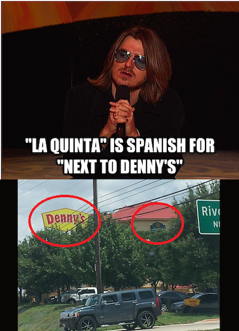

```{=html}
<script language="JavaScript" src="js/exercise-font-size.js"></script>
```
```{r setup, include=FALSE}
# load packages-----------------------------------------------------------------
library(learnr)
library(gradethis)
library(tidyverse)
library(dsbox)


# set options for exercises and checking ---------------------------------------
tutorial_options(
  exercise.timelimit = 60, 
  exercise.checker = gradethis::grade_learnr
  )

# hide non-exercise code chunks ------------------------------------------------
knitr::opts_chunk$set(echo = FALSE)

# setup ------------------------------------------------
states <- read_csv(here::here("inst","tutorials", "10-dennyslaquinta", "states.csv"), show_col_types = FALSE)

dennys2 <- dennys %>%
  mutate(establishment = "Denny's")
laquinta2 <- laquinta %>%
  mutate(establishment = "La Quinta")

locations <- bind_rows(list(dennys2, laquinta2))

nc_dn <- dennys %>%
  filter(state == "AK")

nc_lq <- laquinta %>%
  filter(state == "AK")

nc_dn_lq <- full_join(nc_dn, nc_lq, by = "state")

haversine <- function(long1, lat1, long2, lat2, round = 3) {
  # convert to radians
  long1 = long1 * pi / 180
  lat1  = lat1  * pi / 180
  long2 = long2 * pi / 180
  lat2  = lat2  * pi / 180
  
  R = 6371 # Earth mean radius in km
  
  a = sin((lat2 - lat1)/2)^2 + cos(lat1) * cos(lat2) * sin((long2 - long1)/2)^2
  d = R * 2 * asin(sqrt(a))
  
  return( round(d,round) ) # distance in km
}

nc_dist <- nc_dn_lq %>%
  mutate(distance = haversine(longitude.x, latitude.x,
                              longitude.y, latitude.y))

nc_mindist <- nc_dist %>%
  group_by(address.x) %>%
  summarise(closest = min(distance))

```

## Introduction

```{r photo, fig.margin = TRUE, echo = FALSE, out.width="50%"}

```

Today, we'll be exploring a phenomenon first brought to light by comedian Mitch Hedberg: the seemingly-correlated locations of Denny's Restuarants and La Quinta Inn motels throughout the United States.

These data are from a [post](http://njgeo.org/2014/01/30/mitch-hedberg-and-gis/), by John Reiser on his *new jersey geographer blog* , citing [this](https://www.reddit.com/r/funny/comments/wn66x/holy_shit_mitch_hedberg_was_right/) Reddit post as inspiration for gathering the data. The reproducible scraping process is located [here](https://github.com/johnjreiser/HedbergGIS).

### Learning goals

-   Refine your data wrangling skills
-   Compare and analyze spatial data
-   Answer the research question of interest: do Denny's and La Quinta locations tend to be near each other?

### Packages and Data

Run the following code to load our packages.

```{r load-packages, exercise=TRUE}
library(tidyverse)
library(dsbox)
```

```{r load-packages-check}
grade_this_code("The tidyverse and dsbox packages are now loaded")
```

<!-- ## Data -->

<!-- The codebook for the `dennys` dataset is as follows: -->

<!-- +---------------------+-------------------------------------------+ -->

<!-- | Name                | Description                               | -->

<!-- +:====================+:==========================================+ -->

<!-- | `address`           | Street address of the restaurant                          | -->

<!-- +---------------------+-------------------------------------------+ -->

<!-- | `city`            | City of the restaurant        | -->

<!-- +---------------------+-------------------------------------------+ -->

<!-- | `state`    | US State of the restaurant    | -->

<!-- +---------------------+-------------------------------------------+ -->

<!-- | `zip`     | US ZIP Code of the restaurant     | -->

<!-- +---------------------+-------------------------------------------+ -->

<!-- | `longitude` | The longitude of the restaurant. in degrees | -->

<!-- +---------------------+-------------------------------------------+ -->

<!-- | `lattiude`       | The latitude of the restaurant. in degrees     | -->

<!-- +---------------------+-------------------------------------------+ -->

<!-- The very similar codebook for the `laquinta` dataset is as follows: -->

<!-- +---------------------+-------------------------------------------+ -->

<!-- | Name                | Description                               | -->

<!-- +:====================+:==========================================+ -->

<!-- | `address`           | Street address of the inn                          | -->

<!-- +---------------------+-------------------------------------------+ -->

<!-- | `city`            | City of the inn        | -->

<!-- +---------------------+-------------------------------------------+ -->

<!-- | `state`    | US State of the inn    | -->

<!-- +---------------------+-------------------------------------------+ -->

<!-- | `zip`     | US ZIP Code of the inn     | -->

<!-- +---------------------+-------------------------------------------+ -->

<!-- | `longitude` | The longitude of the inn. in degrees | -->

<!-- +---------------------+-------------------------------------------+ -->

<!-- | `lattiude`       | The latitude of the inn. in degrees     | -->

<!-- +---------------------+-------------------------------------------+ -->

## Warm Up

### Dimensions and Variables

We will begin with a quick warmup exercise before diving deeper into the data wrangling. Fill in the following code chunk to examine how many rows and columns are in each data set.

```{r dimensions, exercise=TRUE}

dennys %>%
  ___()

dennys %>%
  ___()
  
laquinta %>%
  ___()

laquinta %>%
  ___()

```

```{r dimensions-hint}

Use the `nrow()` and  `ncol()` functions!
  
```

```{r dimensions-solution}
dennys %>%
  nrow()

dennys %>%
  ncol()
  
laquinta %>%
  nrow()

laquinta %>%
  ncol()
```

```{r dimensions-check}
grade_this_code("Those are the dimensions!")
```

We note that the number of rows is different between the two datasets, but the number of columns is the same. Does this make sense? What do you think the rows and columns represent?

### Variable Definitions

Using the code chunk, run the R command that retrieves the documentation for a function, in this case for the `dennys` and `laquinta` datasets.

```{r documentation, exercise=TRUE}
dennys

laquinta
```

```{r documentation-hint}
Recall that typing `?` before an function or dataset's name retrieves this info.
```

```{r documentation-solution}
?dennys

?laquinta
```

```{r documentation-check}
grade_this_code("Were you right? Does the ratio of restaurants to inns surprise you?")
```

If you are curious about how the data were collected or the motivation behind the research question, feel free to visit the linked websites in the documentation before returning to the exercises.

## Frequencies

### Most and fewest Denny's

We will now compare the number of restaurants and inns per states. Which states have the most, and fewest, Denny's locations? Note that the District of Columbia is included as DC. Leave it in and proceed, just noting that there are **51** values for the state variable.

Use `arrange(desc())` and `slice()` to report your answer in a single 10x2 dataframe. Here is some code to get you started:

```{r most-fewest-dennys, exercise=TRUE}
dennys %>%
  group_by(___) %>%
```

```{r most-fewest-dennys-hint-1}
dennys %>%
  group_by(state) %>%
```

```{r most-fewest-dennys-hint-2}
dennys %>%
  group_by(state) %>%
  summarise(restaurants = n()) %>%
```

```{r most-fewest-dennys-hint-3}
There are two more lines of code needed. The necessary functions are 'arrange()' and 'slice()'. 
Use the documentation for those functions to try to figure them out!
```

```{r most-fewest-dennys-solution}
dennys %>%
  group_by(state) %>%
  summarise(restaurants = n()) %>%
  arrange(desc(restaurants)) %>%
  slice(c(1:5, 47:51))
```

```{r most-fewest-dennys-check}
grade_this_code("California has the most, and Delaware the fewest.")
```

### Most and fewest La Quintas

Now, let's do the same for La Quintas. Which states have the most, and fewest, inns? However, this time our dataset has many non-state values. We can employ a function from the `*_join()` family to compare values to values in the `states` dataset, which we will also have to load. It contains a column called "abbreviation" with the 51 desired state (and DC) names.

We'll use some code similar to the previous solution to get you started.

```{r most-fewest-laquinta, exercise=TRUE}
laquinta %>%
  group_by(state) %>%
  summarise(motels = n()) %>%
  arrange(desc(motels)) %>%
```

```{r most-fewest-laquinta-hint-1}
Which join function do we want? The "abbreviation" column in `states` has exactly the values we desire. 
However, since some states may not have any locations, an 'inner_join()' would be our desired solution. 
Note how many rows remain, though!
```

```{r most-fewest-laquinta-hint-2}
laquinta %>%
  group_by(state) %>%
  summarise(motels = n()) %>%
  arrange(desc(motels)) %>%
  inner_join(states, by = c("____" = "abbreviation")) %>%
```

```{r most-fewest-laquinta-hint-3}
With the '*_join()' call, we now have two additional columns in our dataframe. 
Use 'select()' to select the two columns we desire (state, motels) when reporting your answer.
```

```{r most-fewest-laquinta-solution}
laquinta %>%
  group_by(state) %>%
  summarise(motels = n()) %>%
  arrange(desc(motels)) %>%
  inner_join(states, by = c("state" = "abbreviation")) %>%
  slice(c(1:5, 44:48)) %>%
  select(state, motels)
```

## Frequency per Square Mile

We are now interested in examining the ratios of both Denny's and La Quinta locations per thousand square miles in states.

Use `mutate()` after the following starter code to create a new variable. Then, use `arrange(desc())`, `slice()`, and `select()` to report your answer as two 10x2 dataframes.

```{r locations-per-area, exercise = TRUE}
dennys %>%
  group_by(state) %>%
  summarise(restaurant = n()) %>%
  inner_join(states, by = c("state" = "abbreviation")) %>%
  mutate(restaurantsperarea =  ___)
  
laquinta %>%
  group_by(state) %>%
  summarise(motels = n()) %>%
  inner_join(states, by = c("state" = "abbreviation")) %>%
  mutate(motelsperarea =  ___)
```

```{r locations-per-area-hint-1}
Run `?mutate` to pull up the documentation if you need to jog your memory!
```

```{r locations-per-area-hint-2}
dennys %>%
  group_by(state) %>%
  summarise(restaurants = n()) %>%
  inner_join(states, by = c("state" = "abbreviation")) %>%
  mutate(restaurantsperarea =  restaurants / area) %>%
  arrange(desc(restaurantsperarea)) %>%
  slice(c(___, ___)) %>%
  
laquinta %>%
  group_by(state) %>%
  summarise(motels = n()) %>%
  inner_join(states, by = c("state" = "abbreviation")) %>%
  mutate(motelsperarea =  motels / area) %>%
  arrange(desc(motelsperarea)) %>%
  slice(c(___, ___)) %>%
```

```{r locations-per-area-hint-3}
dennys %>%
  group_by(state) %>%
  summarise(restaurants = n()) %>%
  inner_join(states, by = c("state" = "abbreviation")) %>%
  mutate(restaurantsperarea =  restaurants / area) %>%
  arrange(desc(restaurantsperarea)) %>%
  slice(c(1:5, 47:51)) %>%
  select(___, ___)
  
laquinta %>%
  group_by(state) %>%
  summarise(motels = n()) %>%
  inner_join(states, by = c("state" = "abbreviation")) %>%
  mutate(motelsperarea =  motels / area) %>%
  arrange(desc(motelsperarea)) %>%
  slice(c(1:5, 44:48)) %>%
  select(___, ___)
```

```{r locations-per-area-solution}
=dennys %>%
  group_by(state) %>%
  summarise(restaurants = n()) %>%
  inner_join(states, by = c("state" = "abbreviation")) %>%
  mutate(restaurantsperarea =  restaurants / area) %>%
  arrange(desc(restaurantsperarea)) %>%
  slice(c(1:5, 47:51)) %>%
  select(state, restaurantsperarea)
  
laquinta %>%
  group_by(state) %>%
  summarise(motels = n()) %>%
  inner_join(states, by = c("state" = "abbreviation")) %>%
  mutate(motelsperarea =  motels / area) %>%
  arrange(desc(motelsperarea)) %>%
  slice(c(1:5, 44:48)) %>%
  select(state, motelsperarea)
```

```{r locations-per-area-check}
grade_this_code("Great wrangling work!")
```

Based on the tibbles you created, answer the following question:

```{r frequency-quiz}
question("Which of these statements are true? Select all that apply",
  answer("Michigan has the fifth-fewest La Quinta's per area", correct = TRUE),
  answer("Alaska has the fewest sum total of restaurants AND inns overall.", message = "Recall that this variable is a ratio of locations per area, not raw location counts."),
  answer("Rhode Island is first on the La Quinta list and second on the Denny's list, but it actually has fewer inns than motels.", correct = TRUE),
  answer("Rhode Island is first on the La Quinta list and second on the Denny's list, so it must have more inns than motels.", message = "Should we compare rank on the list, or overall rate?"),
  correct = "Correct!",
  allow_retry = TRUE,
  random_answer_order = TRUE
)
```

Great interpretations! Now, before we proceed with visualization tasks, we want to put the datasets into a single dataframe.

Use the following code chunk to add a new variable to refer to the establishment. Since the two data frames have the same columns, we can easily bind them with the `bind_rows()` function:

```{r bind-rows, exercise = TRUE}
dennys2 <- dennys %>%
  mutate(establishment = "Denny's")
laquinta2 <- laquinta %>%
  mutate(establishment = "La Quinta")

locations <- bind_rows(list(dennys2, laquinta2))
```

```{r bind-rows-check}
grade_this_code("We're all ready to plot!")
```

## Visualization

### State by State

The following two questions ask you to create visualizations. These should follow best practices you have learned so far, such as informative titles, axis labels, etc. See <http://ggplot2.tidyverse.org/reference/labs.html> for help with the syntax. You can also choose different themes to change the overall look of your plots, see <http://ggplot2.tidyverse.org/reference/ggtheme.html> for help with these.

### North Carolina

Using `ggplot()`, filter the locations for North Carolina only, and plot the coordinates of both Denny's and La Quinta to examine whether Mitch Hedberg's joke holds.

*The use of `alpha = 0.7` inside `geom_point()` allows us to better see the overlaid points.*

```{r plot-nc, exercise=TRUE}
locations %>%
  filter(___) %>%
  ggplot(mapping = aes(___, ___, ___)) +
  geom_point(alpha = 0.7) +
  coord_fixed()
```

```{r plot-nc-hint}
locations %>%
  filter(state == "NC") %>%
  ggplot(mapping = aes(x = ___, y = ___, color = ___)) +
  geom_point(alpha = 0.5) +
  coord_fixed()
```

```{r plot-nc-solution}
locations %>%
  filter(state == "NC") %>%
  ggplot(mapping = aes(x = longitude, y = latitude, color = establishment)) +
  geom_point(alpha = 0.5) +
  coord_fixed()
```

```{r plot-nc-check}
grade_this_code("Great work! Now add titles and labels!")
```

Based on your plot, answer the following questions:

```{r north-carolina-1-quiz}
question("There are far more ____ locations than ____ locations in North Carolina",
  answer("Denny's, La Quinta",
    correct = TRUE
  ),
  answer("La Quinta, Denny's"),
  allow_retry = TRUE,
  random_answer_order = TRUE
)
```

```{r north-carolina-2-quiz}
question("Select all (longitude, latitude) combinations that have clusters of locations where the joke holds",
  answer("(-80, 36)",
    correct = TRUE
  ),
  answer("(-78.7, 35.7)",
         correct = TRUE
         ),
  answer("(-80.7, 35.2)",
    correct = TRUE
  ),
  answer("(-79, 35)"),
  allow_retry = TRUE
)
```

### (Everything's bigger in) Texas

Make the same plot, this time filtering for Texas.

```{r texas, exercise=TRUE}
locations %>%
  filter(___) %>%
  ggplot(mapping = aes(___, ___, ___)) +
  geom_point(alpha = 0.5) +
  coord_fixed()
```

```{r texas-solution}
locations %>%
  filter(state == "TX") %>%
  ggplot(mapping = aes(x = longitude, y = latitude, color = establishment)) +
  geom_point(alpha = 0.5) +
  coord_fixed()
```

```{r texas-check}
grade_this_code("Bravo!")
```

Is the trend similar to in North Carolina? Is the trend similar to what you expected? We will now take a more quantitative approach to examining whether or not the joke holds.

## Calculating distance

We will first examine distance using only observations from a North Carolina. Use the code chunk below to create new dataframes called `nc_dn` and `nc_lq`. Then, use a function and to report how many of each there are.

We'll take advantage of a `*_join()` function later to easily calculate distances between locations.

```{r north-carolina, exercise = TRUE}
nc_dn <- dennys %>%
  filter(___)
___(nc_dn)

nc_lq <- laquinta %>%
  filter(___)
___(nc_lq)
```

```{r north-carolina-hint-1}
nc_dn <- dennys %>%
  filter(state == "NC")
___(nc_dn)

nc_lq <- laquinta %>%
  filter(state == "NC")
___(nc_lq)
```

```{r north-carolina-hint-2}
nc_dn <- dennys %>%
  filter(state == "NC")
nrow(nc_dn)

nc_lq <- laquinta %>%
  filter(state == "NC")
nrow(nc_lq)
```

```{r north-carolina-solution}
nc_dn <- dennys %>%
  filter(state == "NC")
nrow(nc_dn)

nc_lq <- laquinta %>%
  filter(state == "NC")
nrow(nc_lq)
```

```{r north-carolina-check}
grade_this_code("28 Denny's, and 12 La Quintas.")
```

How many pairings are there between all Denny's and all La Quinta locations in North Carolina, i.e. how many distances do we need to calculate between the locations of these establishments in North Carolina? Report your answer in the following code chunk:

```{r combinations, exercise = TRUE}

```

```{r combinations-hint-1}
Think about mathematical combinations -- we have 28 options for the Denny's, and 12 for the La Quinta
```

```{r combinations-hint-2}
28 * 12
```

```{r combinations-check}
grade_this({
  if(identical(.result, 336) | identical(.result, 336L)) {
    pass("You get the idea and are ready to join!")
  }
  fail("Not quite. Take a peek at the hint!")
})
```

### Joining

In order to calculate these distances we need to first restructure our data to pair the Denny's and La Quinta locations. To do so, we will join the two data frames. We have four options for combining variables with joins in R:

`inner_join(x, y)`: return all rows from `x` where there are matching values in `y`, and all columns from `x` and `y`.

`left_join(x, y):` return all rows from `x`, and all columns from `x` and `y`. Rows in `x` with no match in y will have `NA` values in the new columns.

`right_join(x, y)`: return all rows from `y`, and all columns from `x` and `y`. Rows in `y` with no match in `x` will have `NA` values in the new columns.

`full_join(x, y)`: return all rows and all columns from both `x` and `y`. Where there are not matching values, returns `NA` for the one missing.

In this case we want to keep all rows and columns from both `nc_dn` and `nc_lq` data frames. So we will use a `full_join()`. The following image illustrates why:

```{r full-join-photo, fig.margin = TRUE, echo = FALSE, out.width="50%"}
knitr::include_graphics("images/full-join")
```

Let's join the data on Denny's and La Quinta locations in North Carolina, and take a look at what it looks like:

```{r north-carolina-join, exercise = TRUE}
nc_dn_lq <- full_join(nc_dn, nc_lq, by = "state")
nc_dn_lq
```

```{r north-carolina-join-check}
grade_this_code(
  "Nice joining!"
)
```

```{r north-carolina-join-quiz}
question("Which of the following are **not** a variable name in the new dataframe?",
  answer("address.x"),
  answer("establishment", correct = TRUE),
  answer("state.x", correct = TRUE),
  answer("state"),
  answer("zip", correct = TRUE),
  answer("distance", correct = TRUE),
  correct = "Correct!",
  allow_retry = TRUE,
  random_answer_order = TRUE
)
```

`.x` in the variable names means the variable comes from the `x` data frame (the first argument in the `full_join()` call, i.e. `nc_dn`), and `.y` means the variable comes from the `y` data frame. These variables are renamed to include `.x` and `.y` because the two data frames have the same variables and it's not possible to have two variables in a data frame with the exact same name.

Now that we have the data in the format we wanted, all that is left is to calculate the distances between the pairs.

### Haversine Distance

One way of calculating the distance between any two points on the earth is to use the Haversine distance formula. This formula takes into account the fact that the earth is not flat, but instead spherical.

This function is not available in R, but we can define it for our use in this code chunk here:

```{r haversine, exercise = TRUE}
haversine <- function(long1, lat1, long2, lat2, round = 3) {
  # convert to radians
  long1 = long1 * pi / 180
  lat1  = lat1  * pi / 180
  long2 = long2 * pi / 180
  lat2  = lat2  * pi / 180
  
  R = 6371 # Earth mean radius in km
  
  a = sin((lat2 - lat1)/2)^2 + cos(lat1) * cos(lat2) * sin((long2 - long1)/2)^2
  d = R * 2 * asin(sqrt(a))
  
  return( round(d,round) ) # distance in km
}
```

```{r haversine-solution}
haversine <- function(long1, lat1, long2, lat2, round = 3) {
  # convert to radians
  long1 = long1 * pi / 180
  lat1  = lat1  * pi / 180
  long2 = long2 * pi / 180
  lat2  = lat2  * pi / 180
  
  R = 6371 # Earth mean radius in km
  
  a = sin((lat2 - lat1)/2)^2 + cos(lat1) * cos(lat2) * sin((long2 - long1)/2)^2
  d = R * 2 * asin(sqrt(a))
  
  return( round(d,round) ) # distance in km
}
```

```{r haversine-check}
grade_this_code("We are ready to calculate!")
```

This function takes five arguments:

-   Longitude and latitude of the first location

-   Longitude and latitude of the second location

-   A parameter by which to round the responses

Calculate the distances between all pairs of Denny’s and La Quinta locations and save this variable as `distance.` Save this in a new dataframe called `nc_dist`.

```{r distance-calc, exercise = TRUE}
nc_dist <- nc_dn_lq %>%
  mutate(___)
```

```{r distance-calc-hint-1}
nc_dist <- nc_dn_lq %>%
  mutate(distance = haversine(___))
```

```{r distance-calc-solution}
nc_dist <- nc_dn_lq %>%
  mutate(distance = haversine(longitude.x, latitude.x,
                              longitude.y, latitude.y))
```

```{r distance-calc-check}
grade_this_code("Great! The values have been stored!")
```

Now, calculate the *minimum* distance between a Denny’s and La Quinta for each Denny’s location. Check the hints if you need help!

```{r minimum-dist, exercise = TRUE}
nc_mindist <- nc_dist %>%
```

```{r minimum-dist-hint-1}
nc_mindist <- nc_dist %>%
  group_by(___) %>%
```

```{r minimum-dist-hint-2}
nc_mindist <- nc_dist %>%
  group_by(address.x) %>%
  summarise(closest = ___)
```

```{r minimum-dist-solution}
nc_mindist <- nc_dist %>%
  group_by(address.x) %>%
  summarise(closest = min(distance))
```

```{r minimum-dist-check}
grade_this_code("You're a wrangling expert now!")
```

### Describe the distribution

Use the following code chunk to examine the distribution of the distances between Denny’s and the nearest La Quinta locations in North Carolina. Generate relevant summary statistics to be able to answer the following question. You will likely need to adjust the binwidth from the default in `geom_histogram()`.

```{r describe-dist, exercise = TRUE}
ggplot(data = ___, mapping = aes(___)) +
  geom_histogram(binwidth = ___)
       
summary(___)
```

```{r describe-dist-solution}
ggplot(data = nc_mindist, mapping = aes(closest)) +
  geom_histogram(binwidth = 8)

summary(nc_mindist)
```

```{r nc-dist-1-quiz}
question("The distribution is:",
  answer("Right-skewed",
    correct = TRUE
  ),
  answer("Left-skewed"),
  answer("Symmetric"),
  correct = "Correct!",
  allow_retry = TRUE,
  random_answer_order = TRUE
)
```

```{r nc-dist-2-quiz}
question("______ of the Denny's locations are greater than 65.444 miles away from a la Quinta",
  answer("More than half",
    message = "Think about what the right-skew means, with the larger mean than median."
  ),
  answer("Exactly half",
         message = "That would be true for the median of the distribution, 53.456"),
  answer("Less than half",
         correct = TRUE),
  correct = "Correct, and we can tell from our histogram, too!",
  allow_retry = TRUE,
  random_answer_order = TRUE
)
```

## Confidence & prediction Intervals

In addition to our analyses, we shall take a look at confidence intervals and prediction intervals.

Using the `predict()` function, we can compute both the confidence intervals and the prediction intervals. Note that the default intervals are at the 95% significance level.

```{r confidence-int, exercise = TRUE}
conf_int <- predict(mass_flip_fit$fit, newflip, interval = "confidence")
head(conf_int)
```

```{r confidence-int-solution}
conf_int <- predict(mass_flip_fit$fit, newflip, interval = "confidence")
head(conf_int)
```

```{r confidence-int-check}
grade_this_code("You have computed the confidence intervals.")
```

Here we see the first six rows of `conf_int`, where `fit` gives us the predicted body mass, `lwr` and `upr` gives us the lower and upper bounds of the confidence interval respectively.

Similarly, by copying the code above and replacing `conf_int` with `pred_int` as well as setting the argument `interval` to "prediction", compute the prediction intervals.

```{r prediction-int, exercise = TRUE}

```

```{r prediction-int-hint}
pred_int <- predict(___, ___, interval = ___)
head(pred_int)
```

```{r prediction-int-solution}
pred_int <- predict(mass_flip_fit$fit, newflip, interval = "prediction")
head(pred_int)
```

```{r prediction-int-check}
grade_this_code("You have computed the prediction intervals.")
```

Now answer the following quiz:

```{r interval-quiz}
question("Which of the following statements are correct? Select all that apply.",
  answer("The prediction intervals are wider than the confidence intervals because there is greater uncertainty when you predict an individual value rather than the mean value for body mass.",
    correct = TRUE
  ),
  answer("The confidence intervals are wider than the prediction intervals because there is greater uncertainty when you predict the mean value rather than an individual value for body mass.",
    message = "width = upper bound - lower bound"
  ),
  answer("A prediction interval for body mass is a confidence interval for a future observation of body mass given the explanatory variable flipper length.",
    correct = TRUE
  ),
  answer("The expected value of the body mass will lie within the confidence interval with probability of 95%",
    message = "The expected value of body mass is fixed, it either lies within the confidence interval or not."
  ),
  answer("Out of all the confidence interval computed for the fitted value, we expect 95% of the confidence intervals to contain the expected value of the body mass.", correct = TRUE),
  correct = "Correct!",
  allow_retry = TRUE,
  random_answer_order = TRUE
)
```

Repeat the same analysis for Texas: (i) filter Denny’s and La Quinta Data Frames for NC, (ii) join these data frames to get a completelist of all possible pairings, (iii) calculate the distances between all possible pairings of Denny’s and La Quinta in NC, (iv) find the minimum distance between each Denny’s and La Quinta location, (v) visualize and describe the distribution of these shortest distances using appropriate summary statistics.

Repeat the same analysis for Texas in the next section.

## Your turn

### In conclusion

```{r final-quiz}
question("Among the states you examined, where is Mitch Hedberg’s joke most likely to hold true?",
  answer("Texas=",
    correct = TRUE
  ),
  answer("North Carolina",
    correct = TRUE
  ),
  correct = "Correct!",
  allow_retry = TRUE
)
```

## Wrap up

We hope you've enjoyed this chance to practice your modelling skills.

That's it! You've finished the last tutorial, congratulations!
